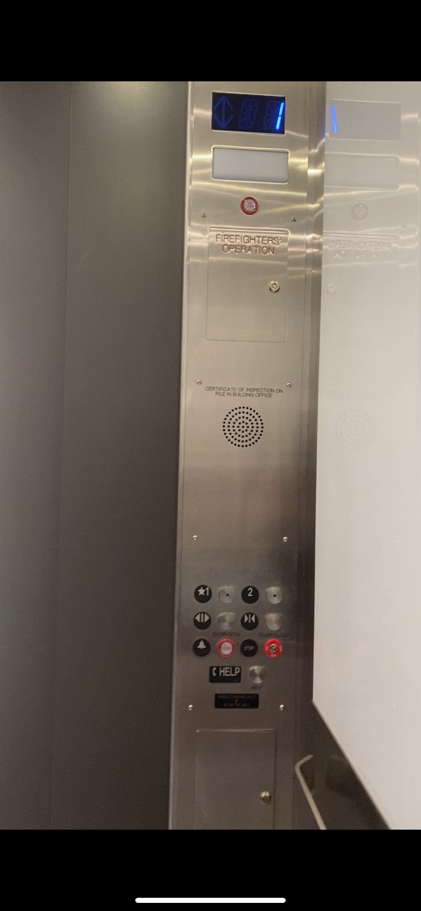
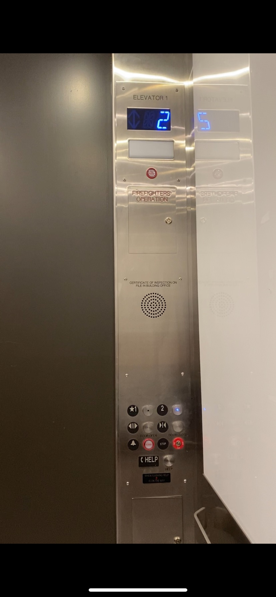
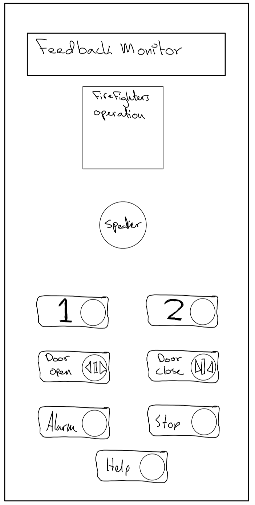

# Report

---

### Links
[Presentation page](https://monimoni0.github.io)

[GitHub repository](https://github.com/Monimoni0/monimoni0.github.io)

[Demo](https://huyen-nguyen.github.io/hci-template/demo.html) (e.g. https://huyen-nguyen.github.io/hci-template/demo.html, the demo file **should not** be named index.html)

### Getting C:
- Find an elevator in the apartment/campus/hotel. Only one example for each student: The elevator in the IMSE building

- Take photos of the control interface

-  Show a gif image of the control interface in operation.

- Find the issues with the current design.

- Explain why it is bad.
- There is a white box underneath the feedbox panel. This box has no use as it does not
light up when a button is pressed and therefore is a waste of space. With the removal
of this box, we can move the firefighters operation door up and closer to the feed back screen.
Moving this box up will be no issue as it is unlikely that a firefighter will be 
handicapped or will need that the firefighters operation door be lower to operate properly.
Additionally, we can connect the circle surrounding the floor numbers to the button 
to avoid any user confusion as to what the buttons do. There can be confusion concerning which 
button opens and closes the elevator door because the "door open" and "door close" text 
is printed under the button and is not very clear. To fix this, we can print the "door open"
and "door close" onto the black field surrounding the button and adding the drawing onto
the button itself. Also, the "help", "stop" and "alarm" buttons are not empahsized. 
These buttons look like any ordinary buttons, they should stand out for easy identification
in case of an emergency.

### Getting B:
- Think about the common things that you use an elevator. List your most common uses and other more rare uses. Does the interface make doing those common things easier?

**Common elevator uses:**  
        - Get to work  
        - Get to class 
        - Get to any location in the building in a different story 
        - Delivery of class packages(amazon, ups, etc.) 
**Rare Uses:**   
        Hospital or Fire Emergency 
                - Call for help in case of health emergency or sudden fire 
        Emergency Stop button   
                - Stops the elevator abruptly 
        Alarm 
                - Alerts foor traffic close to the elevator and building personnel that users in the elevator
are in danger  
        Firefighter Operation  
                - Firegfighter panel door hides essential elevator operations that should not be available for the
average user 
                - Locked with a key that only firefighters and building personnel have 

The interface does facilitate doing these common things 

- Think about how the user interacts with the elevator. What is the common sequence of actions?
1. User Presses up or down outside the elevator
2. User waits for elevator 
3. Elevator door opens
4. User gets in 
5. Elevator door closes
6. Elevator monitor shows what floor they are currently on 
7. User presses their desired floor
8. Elevator control panel lights up the specific button pressed
9. Elevator monitor updates the floor as they move through the bulding floors
10. Elevator stops on desired floor
11. Elevator doors open 
12. User leaves elevator 
13. Elevator doors close

- How does the elevator support the user figure out how to make it work?  
Up and down keys outside elevator allow the user to communicate in what direction in the building they are trying to go  
Numbers next to buttons allow user to know which button corresponds to their desired floor  
Emergency buttons are different for easy finding in case of an emergency  

- How does the elevator provide feedback to the user? 
Elevator monitor communicates with user the progress of their movement (which floor they are currently on) 
Elevator button lights up when pressed to communicate the elevator button was pressed successfully  

- What are some common mistakes you can make with this current design? 
Press the wrong button for "door open" / "door close" if you dont see the text undeneath the button  
accidentally press one of the emrgency buttons because the text on the side of the button is the same color as the rest of the buttons  

- Suggest the improvements to make on the control interface. Sketch your solution. And justify your design decisions.

### Getting A

- Now, imagine that you can have a touch screen on the elevator

- Come with your design for the touch screen? What is the screen size that you want?

- Design and implement interactive features

- Design and implement user feedback

### Extra credits:

- Your design supports people with disabilities

- You provide extra useful information on the display interface.

- Your imagination ...
